# The 22 Knesset Election Results Data Exploration

#### -- Project Status: Active

## Project Intro/Objective

Analyzing the 22 knesset elections public [results](https://votes22.bechirot.gov.il/).

### Methods Used
* Inferential Statistics
* Data Visualization

## Data Acquisition
* All Knesset elections results can be found online on the Israeli Central Elections Committee website.
* List of kalfis address and locations were found [here]( https://bechirot22.bechirot.gov.il/election/Kneset20/Pages/BallotsList.aspx).
* List of all Yeshuvs in Israel with **Yeshuv Type** classification and other meta-data information was found [here](https://data.gov.il/dataset/citiesandsettelments ).  
---
## Data Cleaning
* Absentee Ballot (Maatafot kfolot/hitzoniot) were excluded from the analyses and might be
evaluated on a later phase.
* Kalfis location hebrew text description was cleaned and standardize.
* Missing data: crossing kalfis address Data with Knesset 22 election results reveal 
    four kalfis missing from the elections results:
    - Kalfi 12 in Sakhnin.
    - Klafis 2, 14, 15 in Yirka.  
* This kalfis were [disqualified](https://main.knesset.gov.il/News/PressReleases/Documents/815.pdf) 
by the central elections committee and their data was removed from the elections results data file.

* Two additional kalfis in Arrabe and Shefar'am were disqualified by the central elections committee
  yet their records can be found on elections results data file (More on those on the error voting section).
    
## Data Exploration
Each record in the election results file represent a single kalfi and hold the following information:
* Yeshuv Name
* Yeshuv Number (Yeshuv id)
* Kalfi Number  (essentially kalfi id). 
* BZB - בזב - בעלי זכות בחירה: The number of registered voters assigned to the kalfi.
* Voters: Number of the final voters in the kalfi.
* Error Voters: Number of illegal ( not counted ) votes in the kalfi.
* Voters Division to the different parties (to be analyzed later on).

**Heres how the main four features changed over the last 5 elections:**

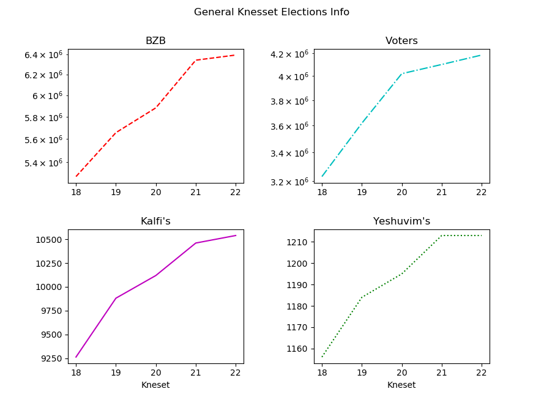

**Looking on the last election numbers:**

| Feature    | Count    |
|----------------|----------|
| Yeshuv Number  |  1213    |
| Kalfi Number   | 10539    |
| BZB            | 6391218  |
| Voters         | 4182726  |

---
### General Population (BZB) Knesset 22 Elections

Aggregating all kalfis registered voters and grouping by **Yeshuv Type** allow us to take a comprehensive look on the population
of bali zchot bhira (BZB) in Israel.

  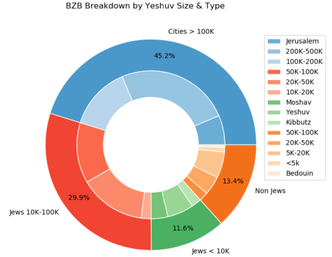

***Important notes regarding BZB population and Yeshuv types:***
* The yeshuvim division to different types focus mostly on Jews\ Non Jews and the  
population size, we will use this division to examine the different voting  
 patterns on different yeshuv types.

* Some jew yeshuvs contain significant non jew population, mainly in big cities:

    | Yeshuv           | Non Jewish Population | % of Yeshuv |
    |------------------|-----------------------|---------|
    | Jerusalem        | 363593                | 39\.55% |
    | Haifa            | 66280                 | 23\.37% |
    | Tel Aviv \- Yafo | 44325                 | 09\.82%  |
    | Lod              | 29238                 | 38\.61% |
    | Be'er Sheva      | 27358                 | 13\.09% |
    | Bat Yam          | 26506                 | 20\.58% |
    | Ashdod           | 23240                 | 10\.35% |
    | Rishon LeZiyyon  | 21702                 | 08\.62%  |
    | Ramla            | 21563                 | 28\.55% |
    | Petah Tiqwa      | 20066                 | 08\.21%  |
    | Akko             | 19393                 | 39\.63% |
    | Netanya          | 19384                 | 08\.92%  |
    | Ashqelon         | 18575                 | 13\.18% |
    | Nazerat Illit    | 17321                 | 42\.07% |
    | Holon            | 15519                 | 07\.99%  |

 ---
### Population (BZB) Per Klafi Knesset 22 Elections
The registered voter population (BZB) divided before every election between
the available kalfis near their place of register residence.  
We can look on different kalfis and the number of BZB voters their are assigned to serve:

BZB BoxPlot          |  BZB Histogram
:-------------------------:|:-------------------------:
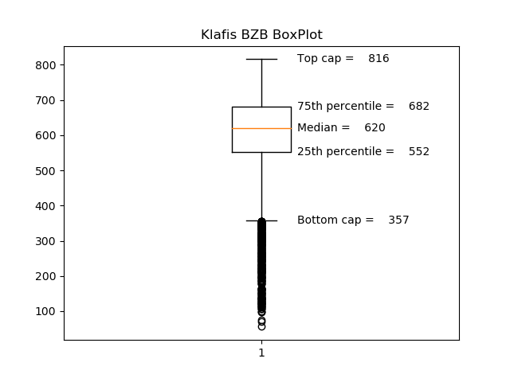  |  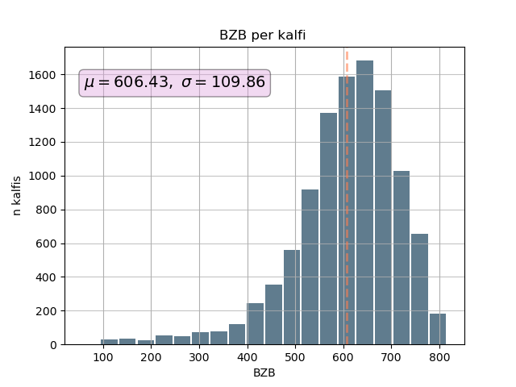

#### Low BZB Kalfis Outliers
* 331 outliers beneath the lower whisker, belonging to 322 unique yeshuvs.  
  Reason is, almost all of the low bzb kalfis belong to small size yeshuvs
  with a single kalfi. This kalfis serves the yeshuve whole population no matter how small that is. 
* There are few exceptions of low bzb kalfis in yeshuvs with more  
  than a single kalfi:
  
  | Most Occuring Yeshuvs    |
  |--------------------------|
  | Dimona                 3 |
  | Sayyid                 3 |
  | Giv'atayim             2 |
  | Yehud                  2 |
  | Jerusalem              2 |
  | Nizzan B               2 |
  | Mas'udin al 'Azazma    2 |
  
* As a result, the overall average BZB per kalfi is lower (606.43) than
the median (620).
  
#### High BZB Kalfis Explored 
  
* Exploring the Yeshuvs where the top 200 BZB kalfis are located:
* 97 unique yeshuvs on that list.
* 76 kalfis are located in 35 unique non jewish yeshuvs.

    | Yeshuv                    | Count |  Yeshuv                    | Count |
    |---------------------------|-------|---------------------------|--------|
    | Tel Aviv \- Yafo          | 17     | Hod HaSharon              | 3      |
    | Jerusalem                 | 13     | Rishon LeZiyyon           | 3      |
    | Rahat                     | 7      | Kuseife                   | 3      |
    | Ashqelon                  | 6      | Shefar'am                 | 3      |
    | Nazareth                  | 6      | Ramat Gan                 | 3      |
    | Arrabe                    | 5      | Julis                     | 3      |
    | Mughar                    | 4      | Sederot                   | 3      |
    | Tamra                     | 4      | Modi'in\-Makkabbim\-Re'ut | 3      |
    | Haifa                     | 4      | Netanya                   | 3      |
    | Afula                     | 4      | Tuba\-Zangariyye          | 3      |
    | I'billin                  | 4      |                           |        |

* **Big Cities**
    * Numbers of large BZB kalfis in Tel Aviv is exceptionly high.  
    * Jerusalem, while holding the second highest number of BZB kalfis,
    is the most populated city by large margin. 
    * Comparing the 6 biggest cities in Israel average bzb per kalfi:
      
        | CIty                  | Average BZB|
        |-----------------------|----------|
        | TEL AVIV \- YAFO      |  630\.78 |
        | PETAH TIQWA           | 619\.43  |
        | JERUSALEM             | 619\.40  |
        | RISHON LEZIYYON       | 611\.32  |
        | HAIFA                 | 607\.75  |
        | ASHDOD                | 602\.37  |

* **Jew Vs. Non Jew Yeshuvs**

    * 76 (38%) out of the 200  highest bzb kalfis are in 35 unique non jew yeshuvs.
    * Most occurring non jewish yeshuvs:

        | Yeshuv              |  Count  |
        |---------------------|---------|
        | Rahat               |    7    |
        | Nazareth            |    6    |
        | Arrabe              |    5    |
        | I'billin            |    4    |
        | Tamra               |    4    |
        | Mughar              |    4    |
        | Tuba\-Zangariyye    |    3   |
        | Julis               |    3    |
        | Shefar'am           |    3    |
        | Kuseife             |    3    |

#### Deeper Look into BZB Per Kalfi by Yeshuv Type
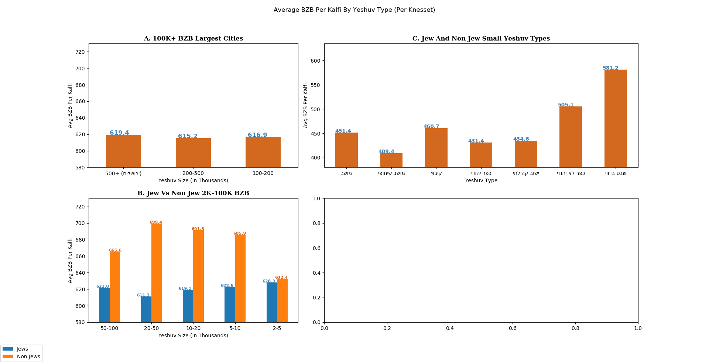  

**B.Jew Vs Non Jew 2K-100K BZB**
* The non jew average BZB is significantly higher Across all categories, apart from 2K-5K.

**C.Jew and Non Jew Small Yeshuv Types**
* Overall lower than average(=606.43) BZB per kalfi across all yeshuv types.
* In non jewish villiages and baduin villiages the average BZB per kalfi is higher:
    * Highest BZB kalfis out of the 45 non jewish villages:

        | Yeshuv           | Kalfi\_Num | Total Klafis | BZB | Vote %  | 
        |------------------|------------|--------------|-----|---------|
        | ***Rummane***          | 1          | ***1***            | 726 | 79\.34% |
        | Nein             | 1          | 2            | 714 | 62\.61% |
        | ***Rumat Heib***       | 2          | ***1***            | 710 | 46\.62% |
        | ***Umm Al\-Qutuf***    | 1          | ***1***            | 708 | 72\.03% |
        | Meiser           | 2          | 2            | 674 | 54\.75% |
        | Ein Rafa         | 1          | 1            | 645 | 54\.11% | 
        
    * Highest BZB kalfis out of the 60 Bedouin tribes:
    
        | Yeshuv              | Kalfi\_Num | Total Kalfis | BZB | Vote %  |
        |---------------------|------------|-------------|-----|---------|
        | Mas'udin al 'Azazma | 4          | 7           | 756 | 55\.10% |
        | Abu Rukayyek        | 3          | 4           | 753 | 43\.25% |
        | Abu Rukayyek        | 2          | 3           | 751 | 34\.27% |
        | A'sam               | 7          | 7           | 747 | 39\.32% |
        | Abu Juway'ad        | 2          | 4           | 746 | 29\.83% |
        | Abu Kuraynat        | 1          | 4           | 744 | 44\.49% |
        | Abu Kuraynat        | 7          | 7           | 740 | 42\.23% |
        | Abu Kuraynat        | 1          | 1           | 739 | 39\.18% |
        | Abu Kuraynat        | 4          | 4           | 736 | 38\.18% |
        
    * With the recent Arabs and Bedouin positive participation trend
        in the knesset elections
      this might be a good time to add Kalfis in some of this yeshuvs.

 
#### Removing low BZB kalfis
* For the sake of exploration, I removed all outliers kalfis with BZB<=357.
* 333 kalfis were removed out of the total 10539 kalfis, 295 yeshuvs were removed. 
* Total average of remaining kalfis natuarally went up, from 606.43 to 618.03.
* Breakdown of BZB per Klafi by the different yeshuv type after outliers removal:
    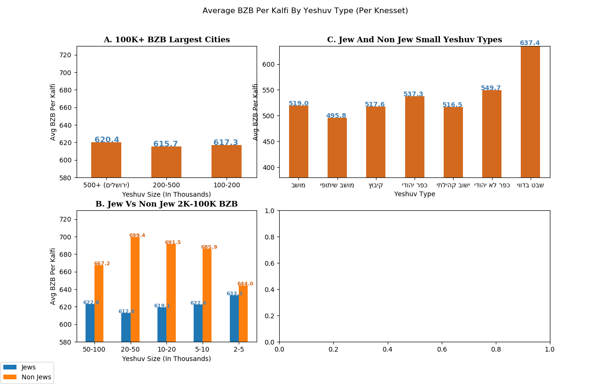  

    * **B.Jew Vs Non Jew 2K-100K BZB**
        * Slight increase in both jew and non jew 2k-5k yeshuvs average BZB.
    * **C.Jew and Non Jew Small Yeshuv Types**
        * Significant average BZB increase in all Yeshuv types.
        * Non jewish villages and Baduin villages average BZB still much higher,  
 with Baduin villages average now higher then the total average.

---
### Error Votes
The knesset elections final results contain the number of error votes in each kalfi.
First glance over the kalfis error votes, two kalfis stand out:  
* Two kalfis in Arrabe and Shefar'am have 100% of the votes being invalid.
* This kalfis were  [disqualified](https://main.knesset.gov.il/News/PressReleases/Documents/815.pdf)
 but their records were kept on the offical results data file, in contrast with other
 disqualified kalfis.  
 
The error votes picture after removing the disqualified kalfis:
 
Error Vote % BoxPlot          |  Error Vote % Histogram
:-------------------------:|:-------------------------:
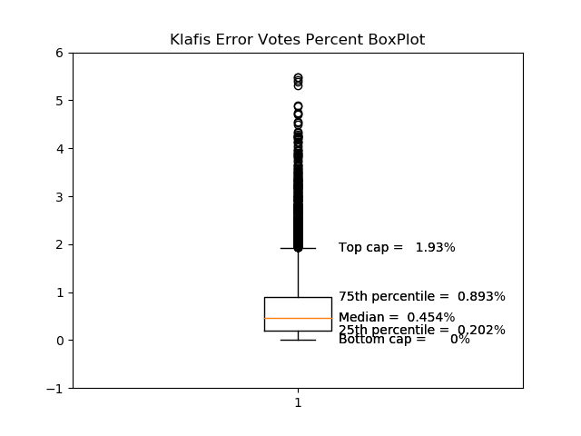  |  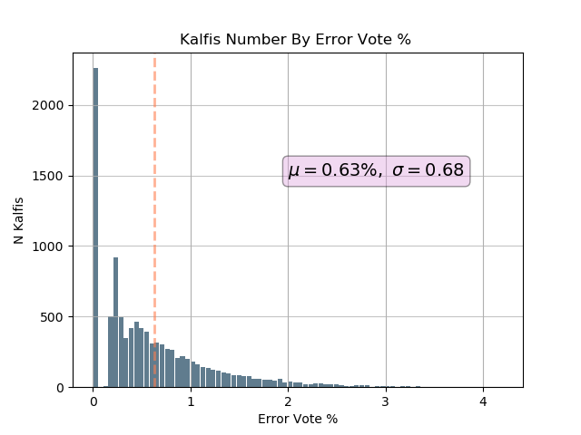

* Very high number of kalfis with 0% error votes pushing the median to a low 0.454%  
 while the average is 0.63% error votes per kalfi.
#### High Error Vote % Outliers
* Total of 516 kalfis in 124 unique yeshuvs are above the upper whisker with an error vote > 1.39%.
* Most occurring yeshuvs:    
     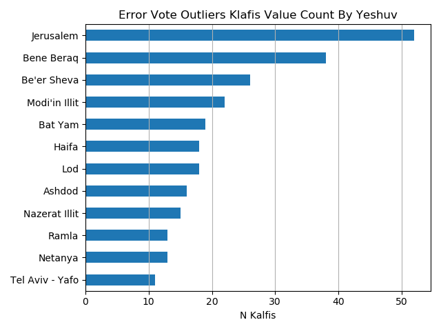  

      
   * Arabs and ultra-orthodox yeshuvs are overly represented at the top outliers error vote % kalfis.
     

* **Jew Vs. Non Jew Yeshuvs**
    * 96 kalfis out of the 516 outliers kalfis are located in 51 non jew yeshuvs (18.6%).
    
#### Deeper Look into Kalfi Error Votes by Yeshuv Type
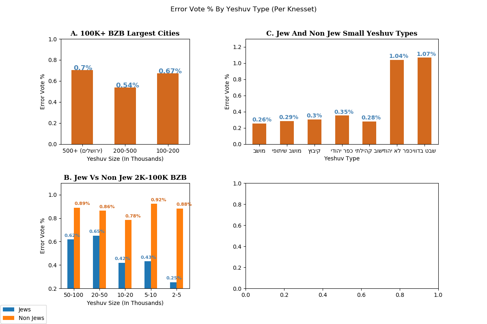  
* Clear error vote difference between jew and non jew yeshhuv across all yeshuv types.

---
### Voting Percent 
 Vote % BoxPlot          |  Vote % Histogram
 :-------------------------:|:-------------------------:
 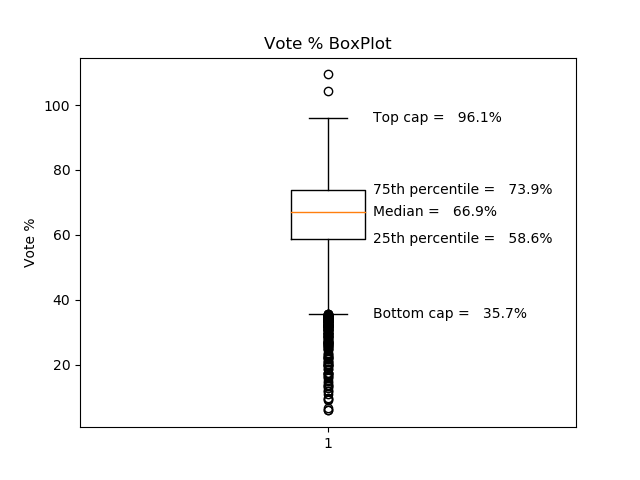  |  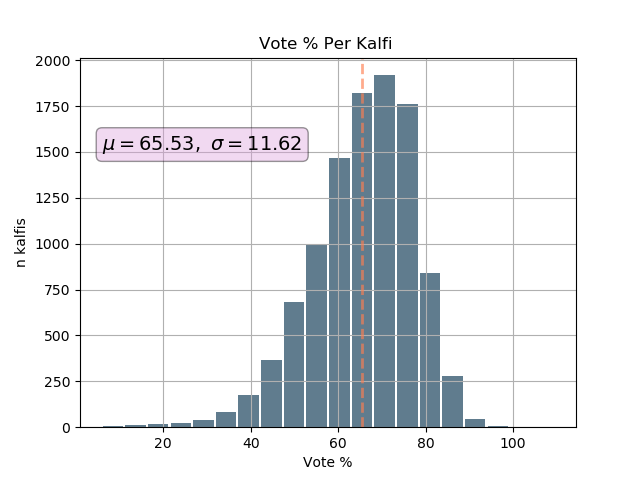
  
The BoxPlot "box", representing the middle 50% of the kalfis, is located between
58.61% to 73.94% with median of 66.9%.  

#### High Vote % Outliers
* A couple of outliers above the top whisker can be detected:  
Yeshuvim כרמים and תלם are well above 100% voting.
The most probable reason is initial high voting percent with 
additional unregistered voters end up voting in כרמים\תלם as well.
    
* Large number of low voting outliers kalfis beneath the lower whisker.

#### Low Vote % Outliers

* There are 153 kalfis with voting percent lower than the box plot lower whisker (<35.7%).  

* This 153 kalfis are located in **only 43 unique yeshivum**, the most occurring ones are:
     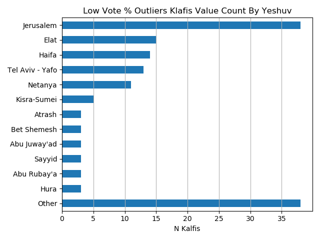  

#### Jew vs Non Jew Yeshuvs:
41 out of the 153 kalfis (26.8%) located in 23 unique non jew yeshuvs.

| Yeshuvs|Count|
|---------------------|--------|
| Kisra\-Sumei        |     5  |
| Abu Juway'ad        |     3  |
| Hura                |     3  |
| Atrash              |     3  |
| Abu Rubay'a         |     3  |
| Sayyid              |     3  |

#### Arab population in Jewish Yeshuvs:

In effort to further analyze the voting patterns in big cities with
frequent under performing kalfis (i.e Jerusalem, Elat and Haifa) I decided to
 check
which of this worst performing jewish yeshuvim kalfis contain arabic printing
 ballots.

**Assuming large part of the BZB registered to this kalfis are non jewish
 arabic speaking citizens.**

* 5 out of 15 kalfis in Elat contain arabic printing, which is a bit odd considering
    only 2260 arabs are living in Elat. 
* Surprisingly, only 3 out of 38 bad performing kalfis in Jerusalem contains
 arabic printing.
* 4 out of the 14 bad performing kalfis in Haifa contains arabic printing.

No additional public data harden the ability to evaluate if certain populations are registered to the low performing kalfis,
further work on this subject might be done later on.

#### Deeper Look into Kalfi Voting % by Yeshuv Type

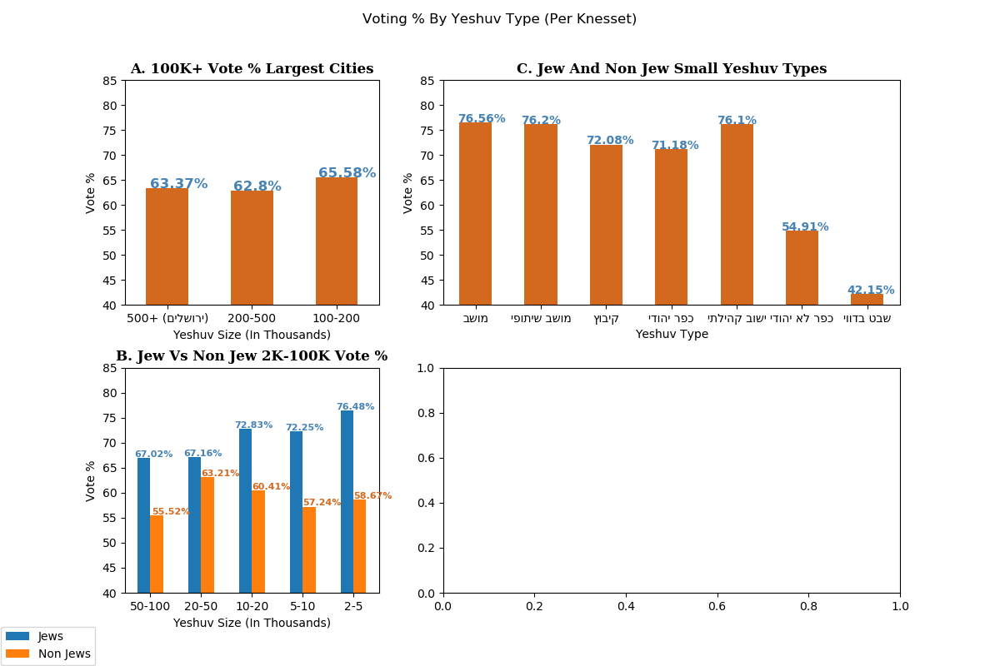  
* Clear error vote difference between jew and non jew yeshhuv across all yeshuv types.

## Correlation

* Moderate negative correlation found between vote % and error vote %,
 meaning generally error vote % goes down as Vote % goes up.
  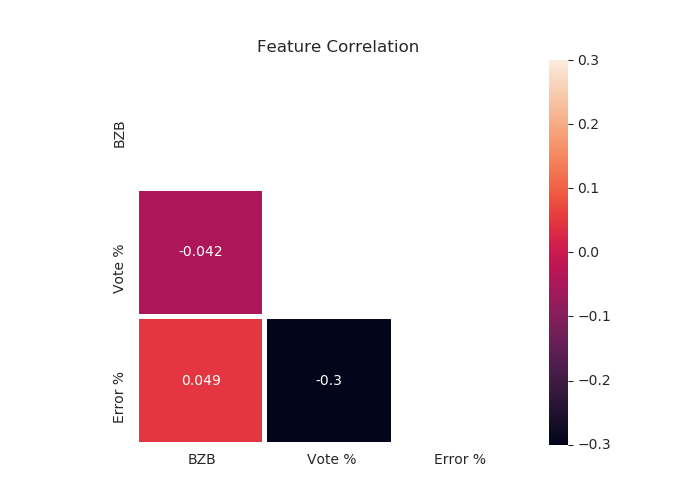  

* Scatter plots of kalfis vote % and error vote % with different BZB population groups cuts:
 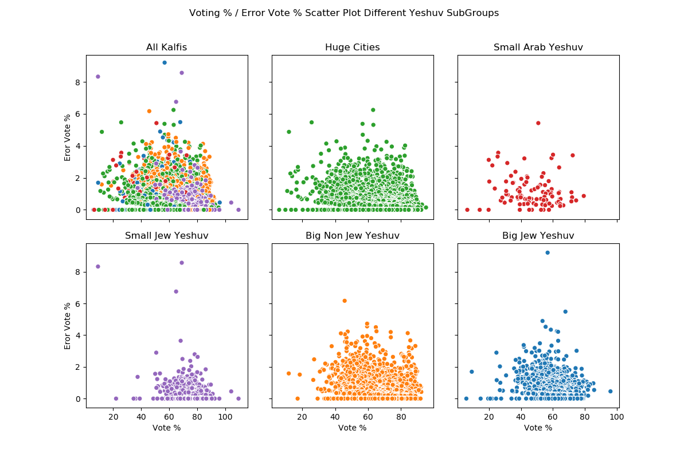  

    

#### Vote % by Kalfi BZB corrleation
* Looking at the complete data set, there was no correlation (-0.042) between the two variables.
* We discovered earlier that there are plenty of very low BZB kalfis, mainly in small
yeshuvs of all types.

  
  
  
  
 
